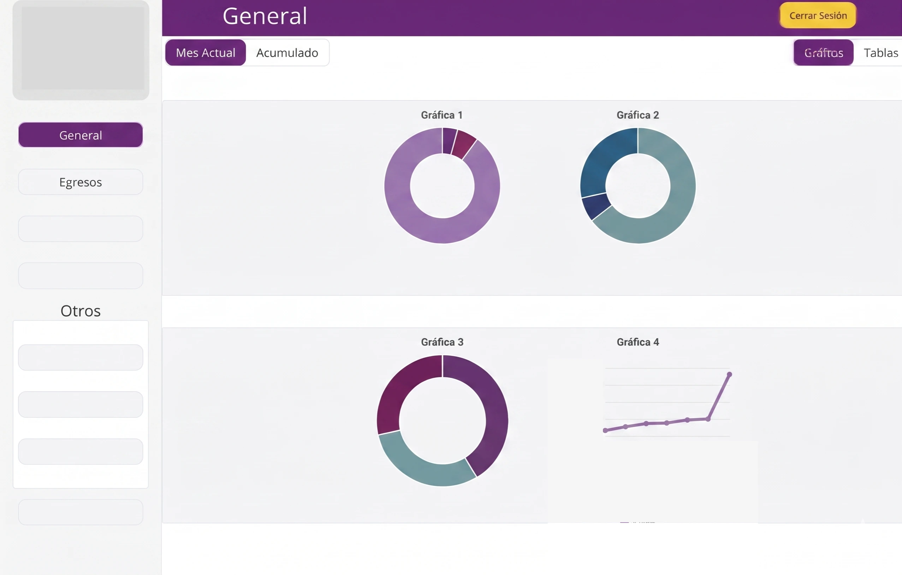
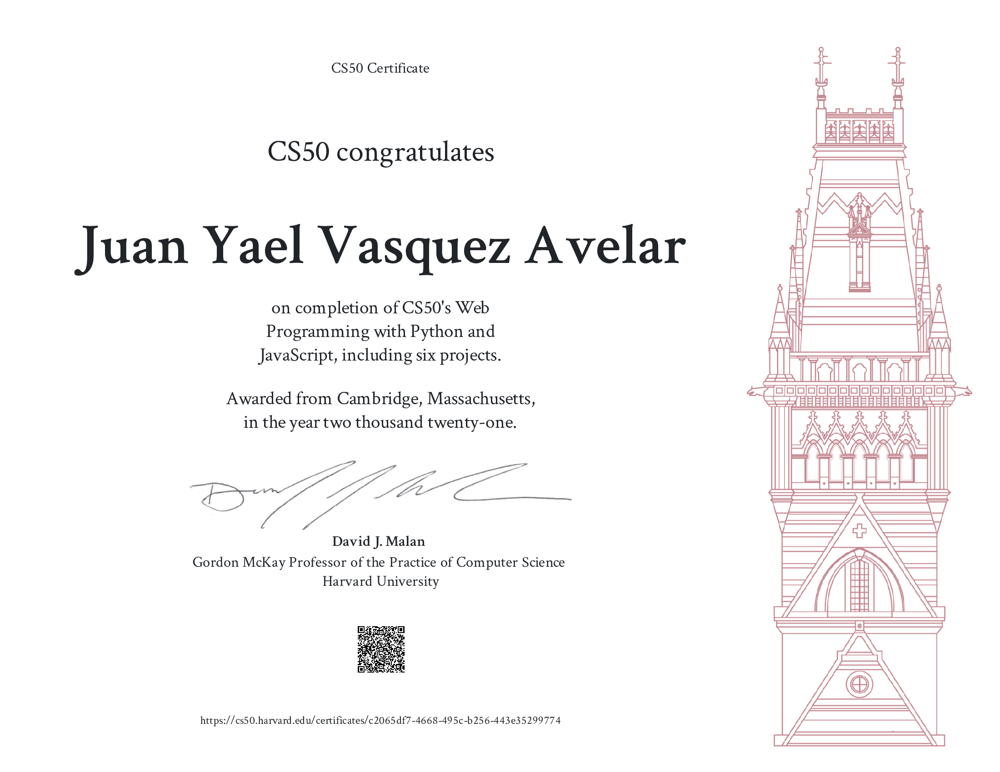
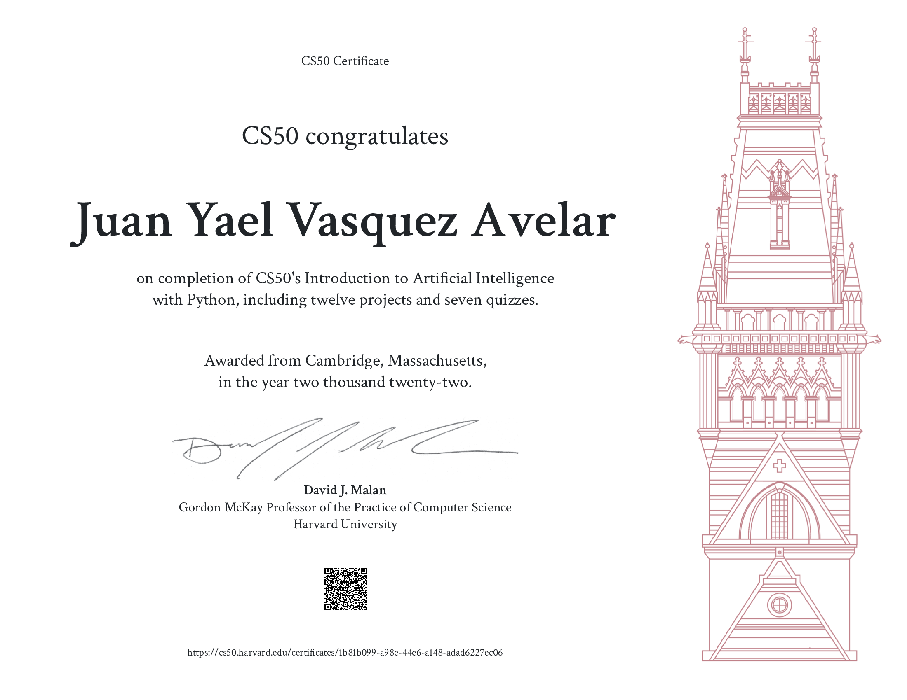
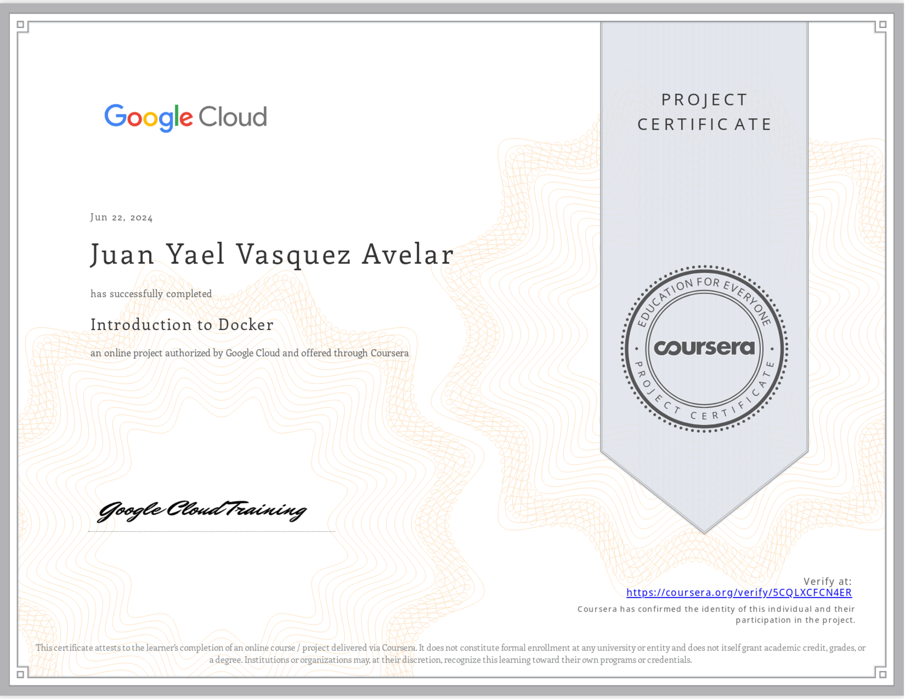
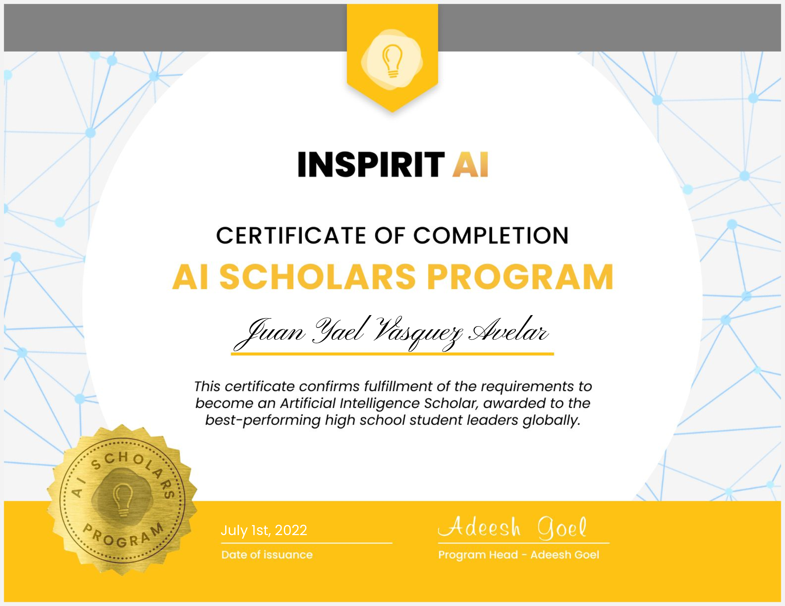
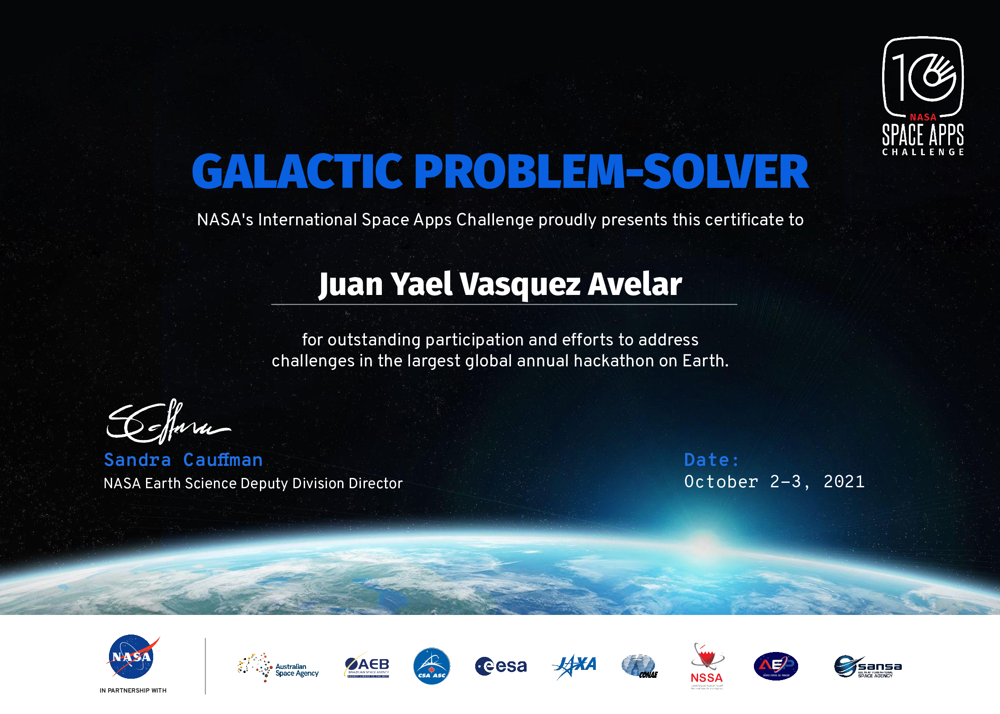

<!--   typing SVG header -->

  
  
  
  
 

  
  
  
  
  
  
  
  
  
  

---

## Projects solving real life problems

> These are the projects I'm most proud of.

---

<table>
<tr>
<td width="50%" valign="top">

**Allium Server** 
2026

A self-hosted Google Photos alternative that routes everything through the TOR network for full privacy and simplicty. Built as a Go CLI/GUI tool — you own your data, your server, your keys.

     

</td>
<td width="50%" valign="top">

**Allium App** 
2026

The companion mobile app to connect to your Allium server, fetch, and cache your images — all through TOR.

 

</td>
</tr>
<tr>
<td width="50%" valign="top">

**Checkit** 
2022

My first major project — and the one that started everything. A full-featured POS system built from the ground up with Django, HTML, CSS, and vanilla JS.

     

</td>
<td width="50%" valign="top">

**Idk What to Gift** 
2026

For people who genuinely don't know what clothes to gift someone. Uses image vectorization to infer the recipient's style (no LLM behind it) and suggests the right gift. Built with Next.js.

        

</td>
</tr>
<tr>
<td width="50%" valign="top">

**Congrats** 
2025

An end-to-end platform for organizing graduation ceremonies — attendees, logistics, communications. React + Vite frontend, Django backend, JWT authentication.

       

</td>
<td width="50%" valign="top">

**CFOSC Dashboard** 
2024

Built for a real organization in Chihuahua, MX. Internal management tool handling operations, records, and workflows. Same battle-tested stack: Django + React Vite.

      

</td>
</tr>
<tr>
<td width="50%" valign="top">

**Xpertia** 
2026

A Next.js platform connecting users with verified domain experts. Browse, discover, and consult.

    

</td>
<td width="50%" valign="top">

&nbsp;

</td>
</tr>
</table>

---

## 🛠️ Other Projects

| Project | Description | Stack |
|---|---|---|
| [**EarthTime Live**](https://github.com/juanavelar87/EarthTime-Live) | Chrome extension showing the Earth in real time via GOES satellite imagery. [Visit it here.](https://chromewebstore.google.com/detail/jcoffcbabgedhpffondaeifapaleopmn?utm_source=item-share-cb) |   |
| [**Go (Q-Learning)**](https://github.com/juanavelar87/Go) | A Go board game AI trained with Q-Learning from scratch |   |
| [**Sudoku Solver**](https://github.com/juanavelar87/SudokuSolver) | First project ever (2020). A sudoku solver in Java. Pure logic.  |  |
| [**Saber Más**](https://github.com/juanavelar87/SaberMas) | Educational website helping schoolchildren with math and core subjects |    |

---

## 🧠 Skills & Stack

<strong>Languages</strong>

  
  
  
  
  
  

<strong>Frameworks</strong>

  
  
  
  
  
  
  
  

<strong>ML / AI</strong>

  
  
  
  
  
  

<strong>DevOps & Tools</strong>

  
  
  
  
  
  
  

<strong>Deployment</strong>

  
  
  
  

---

## 🎓 Certifications & Education

<table>
  <tr>
    <td align="center" style="padding: 10px 25px; max-width: 260px; vertical-align: top;">
      
      
<strong>CS50W</strong>

      
Web Programming with Python and JavaScript

    </td>
    <td align="center" style="padding: 10px 25px; max-width: 260px; vertical-align: top;">
      
      
<strong>CS50AI</strong>

      
Introduction to Artificial Intelligence with Python

    </td>
    <td align="center" style="padding: 10px 25px; max-width: 260px; vertical-align: top;">
      
      
<strong>Google Docker</strong>

      
Docker Certification

    </td>
    <td align="center" style="padding: 10px 25px; max-width: 260px; vertical-align: top;">
      
      
<strong>InspiritAI</strong>

      
AI Scholars Program

    </td>
    <td align="center" style="padding: 10px 25px; max-width: 260px; vertical-align: top;">
      
      
<strong>Space Apps 2021</strong>

      
NASA Space Apps Challenge Certificate

    </td>
  </tr>
</table>

---

## 🌐 Languages

| Language | Level |
|---|---|
| 🇲🇽 Spanish | Native |
| 🇬🇧 English | C1 — Advanced |

---

## ⏱️ Coding Activity

<!-- GitHub contribution snake — generada por el workflow .github/workflows/snake.yml -->
<picture>
  <source media="(prefers-color-scheme: dark)" srcset="https://raw.githubusercontent.com/juanavelar87/juanavelar87/output/github-contribution-grid-snake-dark.svg" />
  <source media="(prefers-color-scheme: light)" srcset="https://raw.githubusercontent.com/juanavelar87/juanavelar87/output/github-contribution-grid-snake.svg" />
  
</picture>

---

## 📫 Reach Me

  
  &nbsp;
  

---

  

